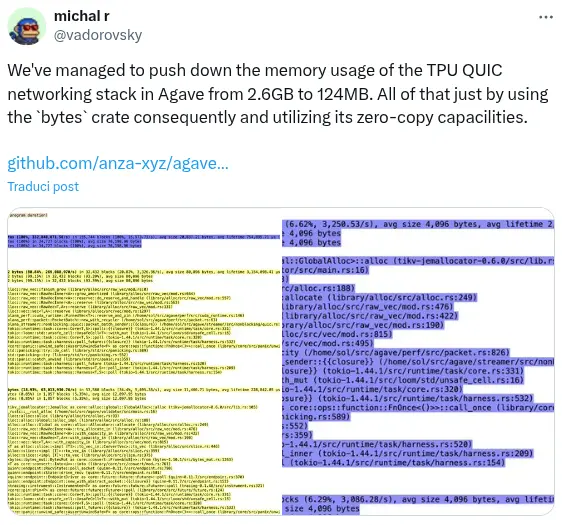

我也参与 Solana 验证器的开发，主要为 Solana RPC 节点编写一些定制模块。
先别因为 Solana 就关掉页面：这篇文章讨论的是 Rust，而不是区块链。

前段时间，一位同事给我看了一条 X 帖子。帖子介绍了 Solana 验证器的一次
大幅优化：QUIC 传输层的内存占用从 **2.6 GB 降到了 124 MB**。

[](https://x.com/vadorovsky/status/1922274156185297394)

## 这次优化为什么能省下这么多内存

先交代一点背景。验证器每秒要处理大量由 RPC 节点发来的交易。交易通过
QUIC 传输到验证器，进入交易池，随后由验证器处理；很多时候，它们还会继续
转发给下一个需要处理交易的验证器。

过去，这些交易以字节形式保存在 `Vec<u8>` 中，再分发到不同模块和服务。
交易数据从收到的那一刻起其实就是不可变的，毕竟我们当然不希望处理中途有人
修改交易。但每进入一个新的上下文，代码就会克隆一次这个 `Vec<u8>`，产生新的
分配，最终导致内存膨胀。

验证器每秒处理数千笔交易，使用交易数据的服务和模块又很多。把这些
`Vec<u8>` 一遍遍深拷贝，浪费的内存很快就会累积起来。交易的生命周期还很短，
这部分内存甚至来不及得到有效复用，问题因此更加明显。

好在单笔交易并不大，不到 1230 字节；可一旦乘以每秒数千笔的吞吐量，内存占用
仍然相当可观。

你可能已经看出问题所在，也觉得这个设计不太合理。没错，不过这里有两个问题
值得分别讨论：

1. 应该怎样解决；
2. 为什么以前没人想到这样做。

先从解决方案说起。

## 可以怎样共享这些字节

这里不止一种办法，其中几种相当直观。

### `Cow` 能解决吗

最先想到的可能是 `Cow`（clone-on-write，写时克隆）。它很适合处理通常保持
不可变、只有确实要修改时才复制的数据。理论上，我们可以借此避免不必要地克隆
`Vec<u8>`。

问题在于，Solana 验证器有许多并行运行在不同线程中的服务。如果只是这样把
`Cow` 传进线程：

```rust
use std::borrow::Cow;

fn main() {
    let bytes = &[0xca, 0xfe, 0xba, 0xbe];
    let cow: Cow<'_, Vec<u8>> = std::borrow::Cow::Owned(bytes.to_vec());

    // 启动一个线程
    let cow_t: Cow<'_, Vec<u8>> = cow.clone(); // 克隆 Cow，在线程中使用
    let join = std::thread::spawn(move || {
        let ptr_addr = cow_t.as_ptr();
        println!("Cow 线程：{cow_t:?}；底层地址：{ptr_addr:p}",);
    });

    let ptr_addr = cow.as_ptr();

    println!("Cow：{cow:?}；底层地址：{ptr_addr:p}",);

    join.join().unwrap();
}
```

你觉得两个地址会相同吗？并不会：

```text
Cow：[202, 254, 186, 190]；底层地址：0x55fec55b9b10
Cow 线程：[202, 254, 186, 190]；底层地址：0x55fec55b9b30
```

那只借用它呢？

```rust
let cow_t = cow.borrow(); // 借用 Cow，再移入线程
```

这也行不通，因为 `thread::spawn` 创建的线程可能比当前函数活得更久，闭包捕获的
数据必须满足 `'static`。这里借用的 `Cow` 依赖当前栈帧，无法满足这个要求。

也许可以改用作用域线程：

```rust
use std::borrow::Cow;

fn main() {
    let bytes = &[0xca, 0xfe, 0xba, 0xbe];
    let cow: Cow<'_, Vec<u8>> = std::borrow::Cow::Owned(bytes.to_vec());

    // 启动一个作用域线程
    std::thread::scope(|s| {
        let handle = s.spawn(|| {
            let ptr_addr = cow.as_ptr();
            println!("Cow 线程：{cow:?}；底层地址：{ptr_addr:p}",);
        });
        handle.join().unwrap();
    });

    let ptr_addr = cow.as_ptr();

    println!("Cow：{cow:?}；底层地址：{ptr_addr:p}",);
}
```

这样确实能得到同一个地址。但我们不能总依赖作用域线程，尤其是在 Solana
生态中，线程之间还要传递许多其他数据。

而且，如果这里真能用作用域线程，其实直接借用 `Vec<u8>` 就够了。

### `Arc<Vec<T>>`

第二种方案是 `Arc<Vec<u8>>`。`Arc` 是智能指针，可以让多个线程共享
`Vec<u8>` 的所有权。克隆 `Arc` 不会克隆整个 `Vec<u8>`，自然也就避开了那部分
内存膨胀。

这个方案可靠而且确实可用，不过还有更合适的选择，Solana 验证器最终采用的也
不是它。

```rust
use std::sync::Arc;

fn main() {
    let bytes = &[0xca, 0xfe, 0xba, 0xbe];
    let bytes = Arc::new(bytes.to_vec());

    // 启动一个线程
    let bytes_t = bytes.clone();
    let join = std::thread::spawn(move || {
        let ptr_addr = bytes_t.as_ptr();
        println!("Arc 线程：{bytes_t:?}；底层地址：{ptr_addr:p}",);
    });

    let ptr_addr = bytes.as_ptr();

    println!("Arc：{bytes:?}；底层地址：{ptr_addr:p}",);

    join.join().unwrap();
}
```

### `Arc<[T]>`

**2025 年 6 月 23 日更新：**

我后来发现，`Arc<[T]>` 其实比 `Arc<Vec<T>>` 更合适。

即使数据不需要共享，只是作为不可变数据保存，它通常也比 `Vec` 更节省空间。
不可变数据不需要记录额外的容量，因此可以省掉 `Vec` 的 capacity 字段。

它的优势包括：

- 克隆极其便宜，复杂度为 `O(1)`，因为只需要克隆指针；
- 在 64 位系统上，栈上大小为 16 字节，而 `Vec` 是 24 字节；
- 实现了到 `[T]` 的 `Deref`，可以像使用切片一样使用，无须手动解引用。

感谢 [sgued@pouet.chapril.org](https://hachyderm.io/@sgued@pouet.chapril.org/114677223492950363)
指出这一点。

如果无须在线程之间共享数据，应当优先考虑 `Rc`，因为它更快、开销也更低。
但这里确实需要跨线程共享，所以 `Arc` 才是合适的选择。

如果连 `Clone` 都不需要，直接使用 `Box<[T]>` 即可，只是当前场景并不符合这个
条件。

想继续了解这项选择，可以观看视频
[为什么应该用 Arc 而不是 Vec](https://www.youtube.com/watch?v=A4cKi7PTJSs)。

### `Bytes`

[Bytes crate](https://docs.rs/bytes/latest/bytes/) 提供了一种高效容器，用于保存和
操作连续内存切片。它主要面向网络和 I/O 场景，并支持零拷贝操作，恰好符合这里
的需要。

Solana 验证器采用的方案，是在收到交易时立刻将其包装为 `Bytes`，此后的各个
环节只克隆这个 `Bytes`。

`Bytes` 的克隆成本很低，因此很适合共享。创建 `Bytes` 实例时，数据保存在内存
中，实例记录指向它的指针；克隆实例时复制的是指针，而不是底层数据。这正是它
如此高效的原因。

如果你写过 C 或 C++，这个方案也许再自然不过。但写 Rust 时，我们很容易遇到
字节数据就直接选择 `Vec<u8>`。这个案例很好地说明了：数据结构选得对不对，会让
性能和内存占用产生巨大差距。

关于它如何管理内存，可以继续阅读
[Bytes 文档](https://docs.rs/bytes/latest/bytes/)。

## 为什么之前没人注意到

比方案本身更值得追问的是：为什么这么明显的问题长期没有得到处理？在我看来，
类似的情况并不少见。我们常常没有认真选择合适的数据结构，结果留下内存膨胀和
性能问题。

一个原因可能是 Solana 验证器的代码库非常庞大，很难追踪所有地方使用的数据
结构。另一个原因，则是验证器通常运行在性能极强的机器上。硬件太充裕，容易让人
产生一种偏见：多占一点内存并不重要。事实并非如此。

看看 [Solana 验证器的运行要求](https://docs.anza.xyz/operations/requirements/)，
就会发现硬件门槛确实很高。许多部署在高性能服务器上的应用也有同样的问题。

我最早接触的是只有 16 MB RAM 的嵌入式系统，那时候性能和内存占用始终是大事。
即便有过这样的经历，现在也仍然很容易忘记它们。

只要每秒发生数千次克隆，内存影响就绝不会小。

### Rust 会让人放松警惕吗

还有一种误区：Rust 以安全和高性能著称，于是我们容易觉得它能
**自动替我们以最佳方式处理一切**。实际上并不是这样。

至今没有任何编程语言能实现完美的内存管理，Rust 也不例外。应用是否高效，最终
仍取决于我们怎样设计和实现它。

### 多想一步：数据能否共享

我把同样的方案应用到自己的 RPC 节点后，整个应用的性能明显提升，可以确定至少
翻了一倍。

这次经历给我的提醒很直接：即使程序运行在强大的机器上，也不能忘记性能；面对
可以共享的数据，更要认真挑选数据结构。

Rust 标准库给了我们 `Cow`、`Arc`、`Rc` 等出色的类型，但我们还是经常习惯性地
调用 `clone`，觉得一次复制不会有什么影响。可在热点路径上，它确实会积少成多。

以后每次写下 `.clone()`，都值得停一下：这里真的需要复制数据吗，还是共享就够了？
对于交易这样从一开始就不可变的数据，这个问题尤其重要。

是时候让 **Rust 瘦瘦身**，尽可能避免不必要的内存膨胀了。


